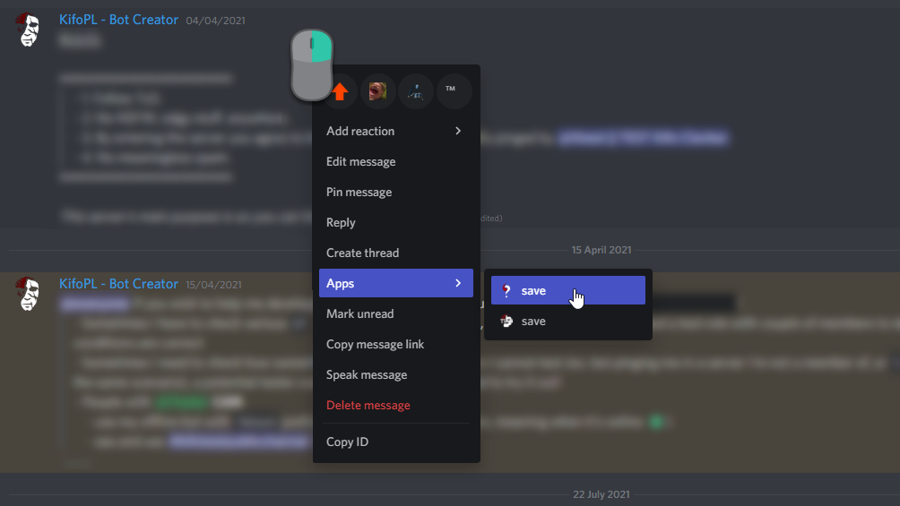

# How to use context menus?

## Table of Contents:

- [How to use context menus?](#how-to-use-context-menus)
	- [Table of Contents:](#table-of-contents)
	- [What are context menus?](#what-are-context-menus)
- [List of context menu actions](#list-of-context-menu-actions)
	- [Using context menus on `PC`](#using-context-menus-on-pc)
		- [Message context menus:](#message-context-menus)
		- [User context menus:](#user-context-menus)
	- [Using context menus on `Mobile`](#using-context-menus-on-mobile)

## What are context menus?

Context menus are the latest feature of integrating applications directly into your communities. By simple <kbd>Right-Click</kbd>, you can choose an action for either message or user.

> Currently there are two places where you can use context menus: on message, and user.

# List of context menu actions

The complete and auto-updated list of context menus can be found [here](../commandList.md#list-of-context-menus-used-with-right-click).

## Using context menus on `PC`

### Message context menus:

Either <kbd>Right-Click</kbd> on the message or <kbd>Left-Click</kbd> on the <kbd>...</kbd> in the top right corner to open Discord context menu. Then go to the `Apps` tab, where you'll find all possible interactions with the message provided by `Kifo Clanker`. Simply click on the desired action.

### User context menus:

<kbd>Right-Click</kbd> on the user to open Discord context menu. Then go to the `Apps` tab, where you'll find all possible interactions with the user, provided by `Kifo Clanker`. Simply click on the desired action.

## Using context menus on `Mobile`

_Currently there is no support for context menus via mobile app. I will update this guide once this feature is implemented._

~by [KifoPL](https://bio.link/KifoPL)
