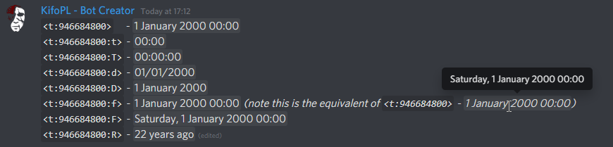
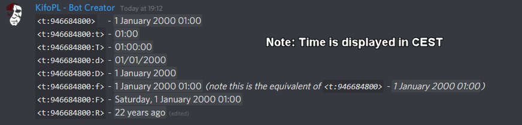

# How to use `/epoch`, date, and time formats?
> This guide covers what the command does and how to correctly convert epoch values to dates. 
> For command syntax, click [here](../commandList.md#epoch).

## Table of Contents:
- [How to use `/epoch`, date, and time formats?](#how-to-use-epoch-date-and-time-formats)
	- [Table of Contents:](#table-of-contents)
	- [What is `epoch`?](#what-is-epoch)
	- [`epoch` uses for Discord](#epoch-uses-for-discord)
	- [`epoch` format](#epoch-format)
		- [Example `epoch` numbers that represent the amount of time passed since `Unix time`:](#example-epoch-numbers-that-represent-the-amount-of-time-passed-since-unix-time)
	- [ISO 8601](#iso-8601)
	- [Date formats:](#date-formats)
		- [Formats:](#formats)
		- [Format syntax (based on C# implementation):](#format-syntax-based-on-c-implementation)
		- [Examples (for epoch = 946684800):](#examples-for-epoch--946684800)
	- [Relative time](#relative-time)

## What is `epoch`?

The **Unix epoch** (or **Unix time** or **POSIX time** or **Unix timestamp**) is the number of seconds that have elapsed since `1st of January, 1970` (midnight UTC/GMT), not counting leap seconds (in **ISO 8601**: `1970-01-01T00:00:00Z`).

Literally speaking, the `epoch` is `Unix time` `0` (midnight `1970-01-01`), but `epoch` is often used as a synonym for `Unix time`. To represent dates from before `Unix time`, negative integers take place.

Some systems store `epoch dates` as a signed 32-bit integer, which might cause problems on `19th of January, 2038` (known as [**Y2038 error**](https://en.wikipedia.org/wiki/Year_2038_problem)).

## `epoch` uses for Discord

`Epoch` is undoubtedly the most powerful and meaningful way to represent a time for a computer. However, it may not seem to be so useful for an end-user. There are a few features in **Discord** (and in **Kifo Clanker™**), that make `epoch` useful.

1. [Interactive time display.](https://discord.com/developers/docs/reference#message-formatting-timestamp-styles)
	
	**Discord Unix Timestamp** feature allows you to insert an interactive time display into the message. For example, `<t:946684800>` turns into `1 January 2000 00:00`. Displayed time is a local time.

	**Syntax:** `<t:timestamp>` or `<t:timestamp:style>`, where:
	- `timestamp` is epoch in seconds,
	- `style` is one of the following:
		- `t`, `T`, `d`, `D`, `f`, `F`, `R`.

	Examples (shown in `UTC`, and local time *(`CEST` in my case)*):

	
	

2. **Kifo Clanker™** commands.

	At the time of writing, the only command using `epoch` and `ISO 8601` dates is [`countdown`](../commandList.md#countdown)

## `epoch` format

Since `epoch` is just a number, there aren't many formats. It all breaks down to what unit `epoch` represents - `seconds`, `milliseconds`, `microseconds`, or `nanoseconds`.

The most common unit *(from my personal experience)* is `milliseconds`. However, due to **Discord** using `seconds`, and users not needing to measure time on **discord** in great precision, **Kifo Clanker™** uses `seconds`.

### Example `epoch` numbers that represent the amount of time passed since `Unix time`:

- `946684800` *(seconds)* - `2000-01-01T00:00:00Z`
- `-14159040000` *(milliseconds)* - `1969-07-21T02:25:00.000Z`
- `1000000000` *(seconds)* - `2001-09-09T01:46:40Z`

## [ISO 8601](https://www.iso.org/iso-8601-date-and-time-format.html)

To fully use the `/epoch` command, it is vital to understand the format of the date understood by **Kifo Clanker™**.

## Date formats:

### Formats:

- `yyyy-MM-ddTHH:mm:ss`
- `yyyy-MM-ddTHH:mm:ssK`
- `yyyy-MM-dd`

**Note:** Date formats used by **Kifo Clanker™** are recognized using [`Date.parse()`](https://developer.mozilla.org/en-US/docs/Web/JavaScript/Reference/Global_Objects/Date/parse) method. This means that some not-mentioned formats may work, although it is not guaranteed. Use at your own risk.

### Format syntax (based on [C# implementation](https://docs.microsoft.com/en-us/dotnet/standard/base-types/custom-date-and-time-format-strings)):

- `yyyy` - 4 digit year, ex. `2000`.
- `M` - 2 digit month, ex. `04`, `11`.
- `d` - 2 digit day, ex. `02`, `20`.
- `T` - literal `T` character, required when specifying date **and** time.
- `H` - 2 digit hour (**24h format**), ex. `01`, `18`.
- `m` - 2 digit minute, ex. `01`, `53`.
- `s` - 2 digit second, ex. `01`, `53`.
- `K` - Time-zone offset relative to `UTC`, ex. `-01:00`, `+07:30`.

### Examples (for epoch = 946684800):

- `2000-01-01T00:00:00`
- `2000-01-01T03:00+03:00`
- `2000-01-01`

## Relative time

<!-- TODO FINISH THIS (it's about the `ms` library) -->

~by [KifoPL](https://bio.link/KifoPL)